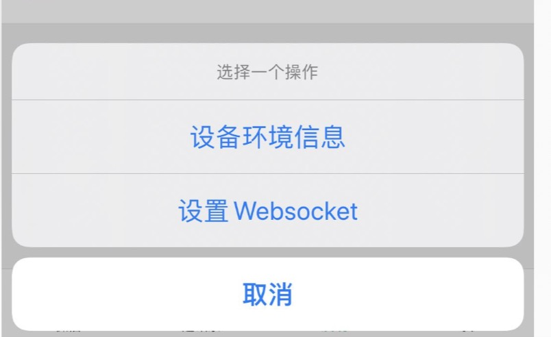
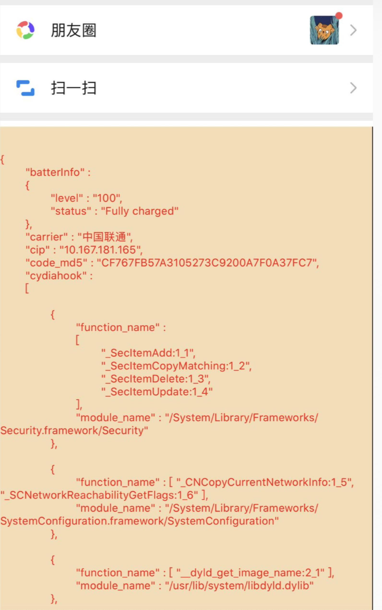

# IOSDetect

IOS设备风控

HOOK检测，可以用来检测插件 HOOk了哪些系统函数, 或者测试越狱商店上那些所谓的越狱屏蔽插件的有效性。

IOS 设备信息检测：应用安全 安全攻防 HOOK 越狱 重打包 patch 签名 注入

1、越狱检测：jab字段,不为空表示越狱  
2、重打包检测: cert字段:证书信息，查看是否为Apple证书  
3、inline hook检测 (详细) 
    cydiahook字段,数组每一项为一个模块中被HOOK的函数，function_name为被HOOK的函数列表，module_name为所属模块 
    数组最后一项为前面被HOOK后的函数的替换函数所在的模块 
4、fishhook检测 (详细) 
    使用fishhoo框架HOOK的函数，funcs为HOOK的函数列表，module_name 替换函数所在的模块。 
5、message hook 检测  (详细) 
    使用method swizzze 替换的 OC方法。 
6、资源patch 检测  (详细) 
7、插件检测  
8、按键精灵检测  
9、其余各种检测自己查看字段  

使用说明: 越狱设备安装后，在设置里面选择要注入的APP , 打开APP后双指长按，弹出窗口点击 设备环境信息

